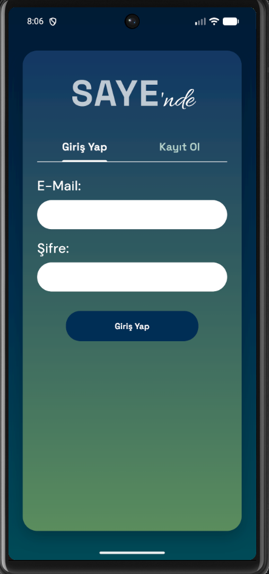
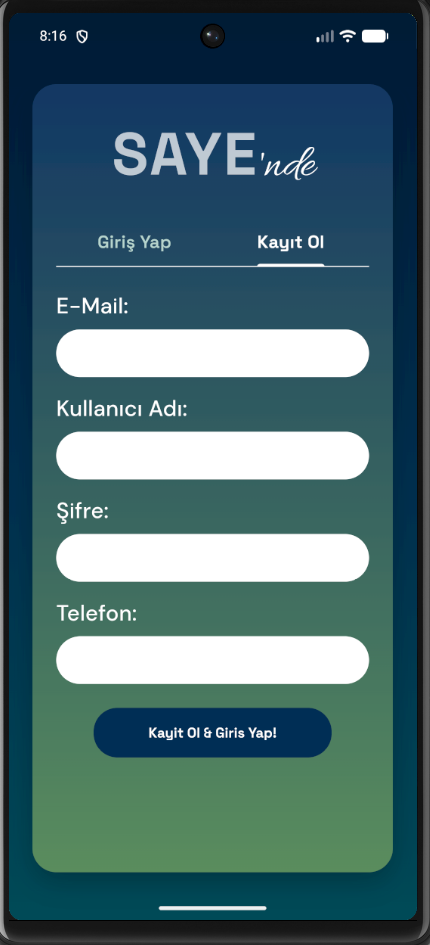
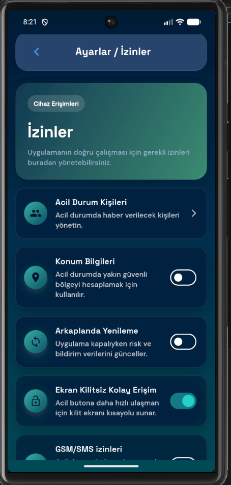
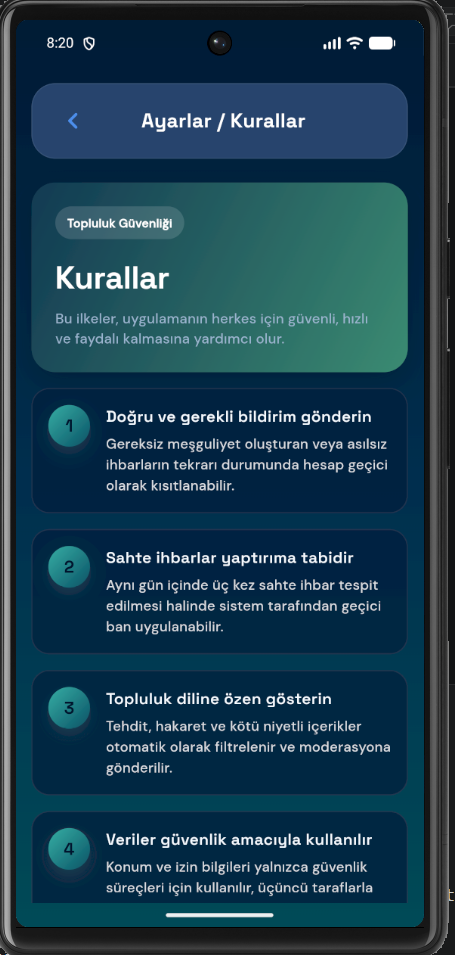
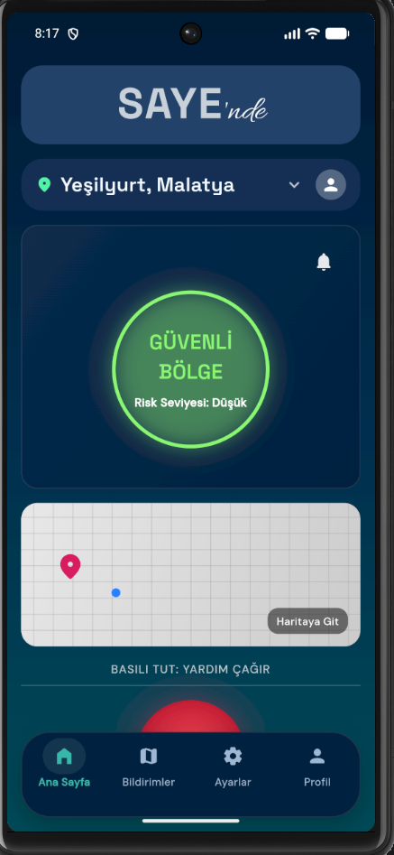
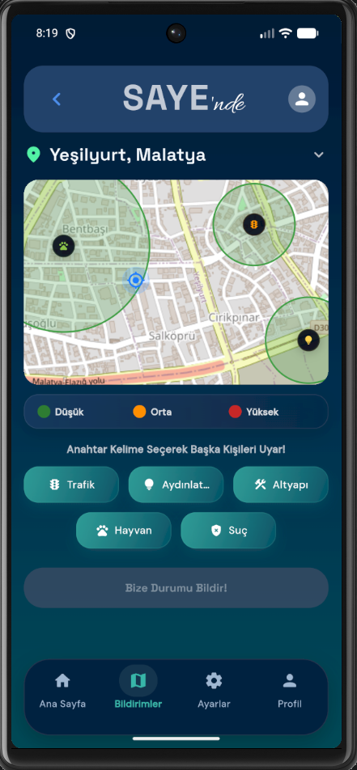
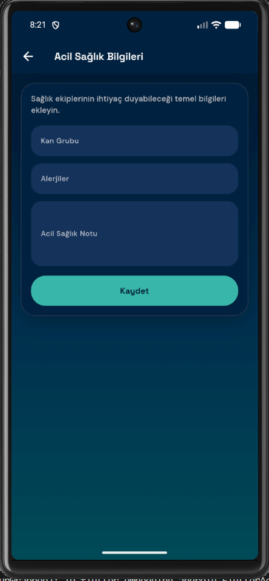
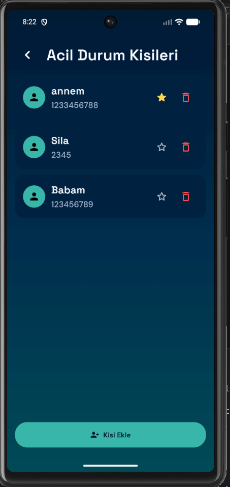
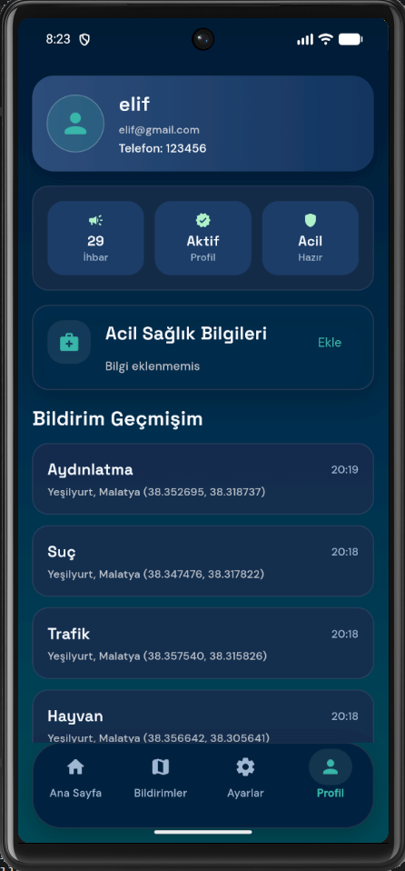
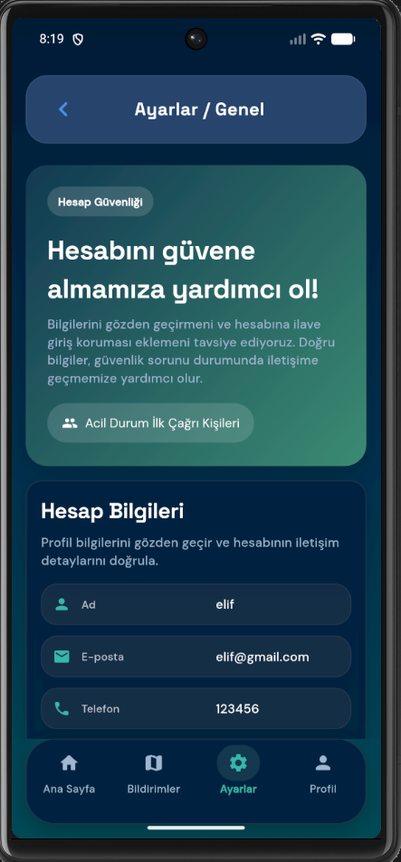

# SAYE — Konum tabanlı risk analizi ve proaktif acil durum

**SAYE** (uygulama adı: **SAYE'nde**), kentsel alanlarda konum verisi ve topluluk bildirimleriyle riskleri önceden görünür kılan, PostGIS destekli coğrafi analiz ve bağlama duyarlı acil durum akışları sunan bir mobil platformdur. Kullanıcılar çevrelerindeki ihbarları haritada izler; risk seviyesine göre arayüz ve acil durum yönlendirmeleri (ör. 112 veya kayıtlı kişilere konum/SMS) devreye girer. Amaç, olay öncesi bilgilendirme ve hızlı müdahale yoluyla güvenlik algısını güçlendirmektir.

Bu depo yalnızca ürün kaynak kodu ve çalıştırma bilgisini içerir; yarışma başvuru raporu, puanlama kriterleri veya jüri metinleri burada yayımlanmaz.

## Ekip

Başvuru belgesinde yer alan yapıya göre **5 kişilik** takım: **1 akademik danışman**, **1 ekip kaptanı** ve **3 üye** (literatür, arayüz/harita, risk algoritması ve veri/UI-DB desteği rolleri). Ad ve iletişim bilgileri başvuru formunda tutulur; bu README’de paylaşılmaz.

## Kullanılan teknolojiler

### Mobil (Flutter)

- Flutter (Dart 3.x), Material arayüz, `flutter_localizations` (TR / EN)
- Durum yönetimi: `ChangeNotifier` tabanlı uygulama durumu
- Ağ ve oturum: `http`, `flutter_secure_storage`
- Harita ve konum: `flutter_map`, `latlong2`, `geolocator`, `geocoding`
- Diğer: `permission_handler`, `shared_preferences`, `url_launcher`, `google_fonts`

### Backend

- Java 17, **Spring Boot 3.5** (Web, Data JPA, Security, Validation)
- Kimlik doğrulama: JWT (jjwt), Spring Security
- API dokümantasyonu: **springdoc-openapi** (Swagger UI)
- Coğrafi veri: **PostgreSQL** + **PostGIS**, **Hibernate Spatial**, JTS

### Altyapı ve entegrasyon

- PostgreSQL veritabanı (`saye_db`), PostGIS uzantısı
- İsteğe bağlı SMS: **Twilio** (ortam değişkenleri ile; boş bırakılırsa ilgili özellikler devre dışı kalabilir)
- Yerel API varsayılanı: `http://localhost:8080` (Android emülatör: `http://10.0.2.2:8080`); üretim için derleme bayrağı `API_BASE_URL` kullanılır

## Ekran görüntüleri

Görseller `resimler/` klasöründedir. Ham çekim için öneri: **dikey (portrait)** yön, uygulamanın gerçek kullanımına uygun akış, mümkünse **tutarlı durum çubuğu**; **PNG**, yüksek çözünürlükte kayıt; repo boyutu için gerektiğinde sıkıştırma. README’de gösterim genişliği sabittir.

### Giriş ve kayıt

<p align="center">
  
  
</p>

### İzinler ve kurallar

<p align="center">
  
  
</p>

### Ana akış ve bildirimler

<p align="center">
  
  
</p>

### Acil durum

<p align="center">
  
  
</p>

### Profil ve ayarlar

<p align="center">
  
  
</p>

## Depo yapısı

| Yol | Açıklama |
| --- | --- |
| `backend/` | Spring Boot REST API, güvenlik ve veri katmanı |
| `frontend/` | Flutter mobil uygulama (`SAYE'nde`) |
| `resimler/` | Tanıtım ekran görüntüleri (PNG) |

## Yerel çalıştırma ve dağıtım

### Backend

1. PostgreSQL kurulu olsun; `saye_db` veritabanını oluşturun (kullanıcı/şifre `application.yml` ile uyumlu).
2. Gerekirse ortam değişkenlerini ayarlayın (üretimde mutlaka güçlü değerler kullanın):

   - `POSTGRES_PASSWORD` — veritabanı parolası (yoksa varsayılan `postgres` ile denenir)
   - `APP_JWT_SECRET` — JWT imza anahtarı
   - `APP_AES_SECRET_KEY` — şifreleme için 32 karakter anahtar
   - `APP_EMAIL_LOOKUP_HMAC_SECRET` — e-posta arama HMAC
   - `TWILIO_ACCOUNT_SID`, `TWILIO_AUTH_TOKEN`, `TWILIO_PHONE_NUMBER` — SMS için (isteğe bağlı)

3. Proje kökünde:

   ```bash
   cd backend
   ./mvnw spring-boot:run
   ```

   Windows (PowerShell):

   ```powershell
   cd backend
   .\mvnw.cmd spring-boot:run
   ```

4. Sağlık kontrolleri: `http://localhost:8080/health`, veritabanı: `http://localhost:8080/health/db`  
   Swagger UI: `http://localhost:8080/swagger-ui/index.html`

### Flutter

1. Bağımlılıklar: `cd frontend` → `flutter pub get`
2. API adresi: Kaynakta `API_BASE_URL` tanımlı değilse Android emülatörde `http://10.0.2.2:8080`, diğer platformlarda `http://localhost:8080` kullanılır. Fiziksel cihaz veya özel sunucu için:

   ```bash
   flutter run --dart-define=API_BASE_URL=https://ornek.sunucu.adresi
   ```

3. Çalıştırma: `flutter run` (hedef cihaz/emülatör seçimi ortamınıza göre)

